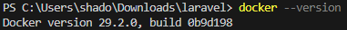
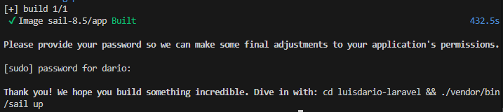
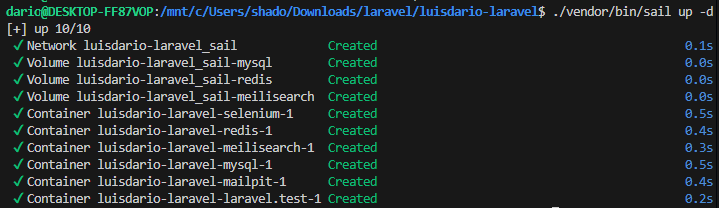
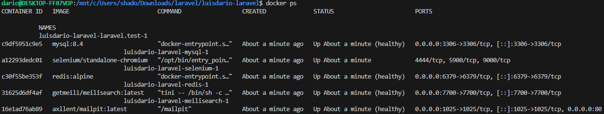
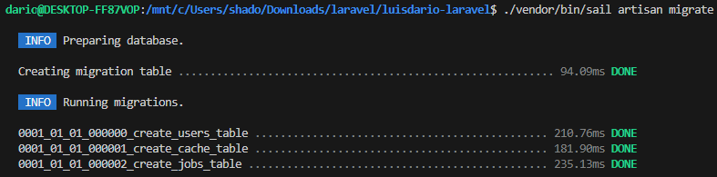
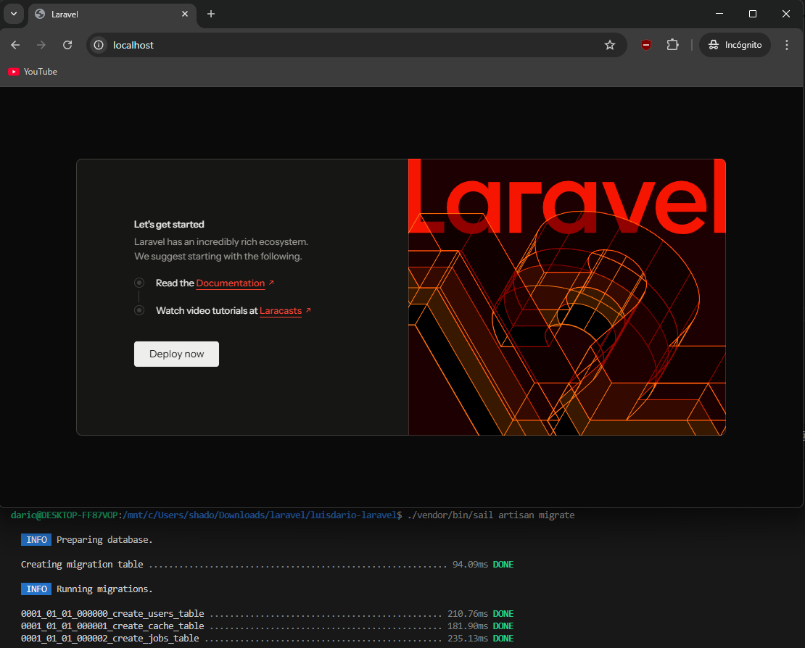
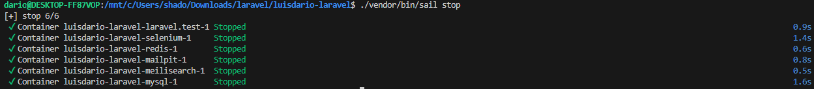

# Entorno de desarrollo Laravel con Sail

## Sumario:

1. Requisitos previos
2. Creación de la estructura
3. Arranque con Laravel Sail
4. Migraciones y prueba final
5. Gestión del entorno

## 1. Requisitos previos

Vamos a empezar preparando el entorno. Lo principal para esta práctica es tener Docker Desktop instalado y corriendo. Si estamos en Windows, es obligatorio tener WSL 2 activado.

En mi caso, ya tengo Docker funcionando correctamente:



## 2. Creación de la estructura

Empezaremos haciendo la estructura del proyecto, abrimos la terminal, vamos a la carpeta donde queramos guardar el proyecto y lanzamos el siguiente comando:

```
curl -s "https://laravel.build/luisdario-laravel" | bash

```

Después de tener todos los archivos veremos un mensaje como este:



## 3. Arranque con Laravel Sail

Laravel Sail es la interfaz de comandos para manejar el entorno Docker de Laravel. Entramos en el directorio que acabamos de crear:

```
cd luisdario-laravel

```

Ahora levantamos los contenedores por primera vez. Usamos el flag `-d` para que se queden en segundo plano y no bloqueen la terminal:

```
./vendor/bin/sail up -d

```

Nos tendría que salir algo así:



Esto nos levanta un stack completo con PHP, Nginx, MySQL y Redis. Para asegurarnos de que todo va bien, podemos listar los contenedores activos con `docker ps`:



## 4. Migraciones y prueba final

Con los contenedores arriba, el siguiente paso es preparar la base de datos. Ejecutamos el comando de migración a través de Sail para crear las tablas iniciales:

```
./vendor/bin/sail artisan migrate
```



Ahora ya podemos comprobar si funciona. Vamos al navegador y entramos en `http://localhost`. Deberíamos ver la página de bienvenida de Laravel.



## 5. Gestión del entorno

Para gestionar el día a día, estos son los comandos que más vamos a usar para parar o iniciar el entorno:

- Para detener los contenedores: `./vendor/bin/sail stop`.

- Para iniciarlos de nuevo: `./vendor/bin/sail up -d`.

- Si necesitamos usar Composer: `./vendor/bin/sail composer install`.


